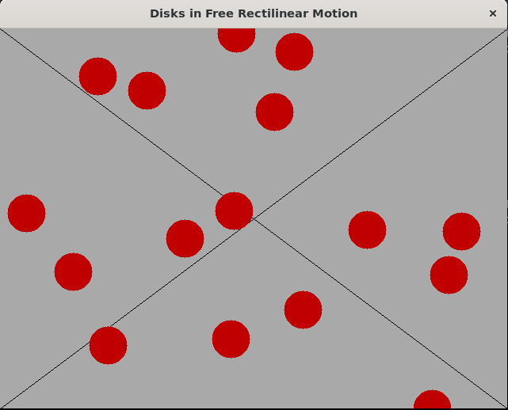
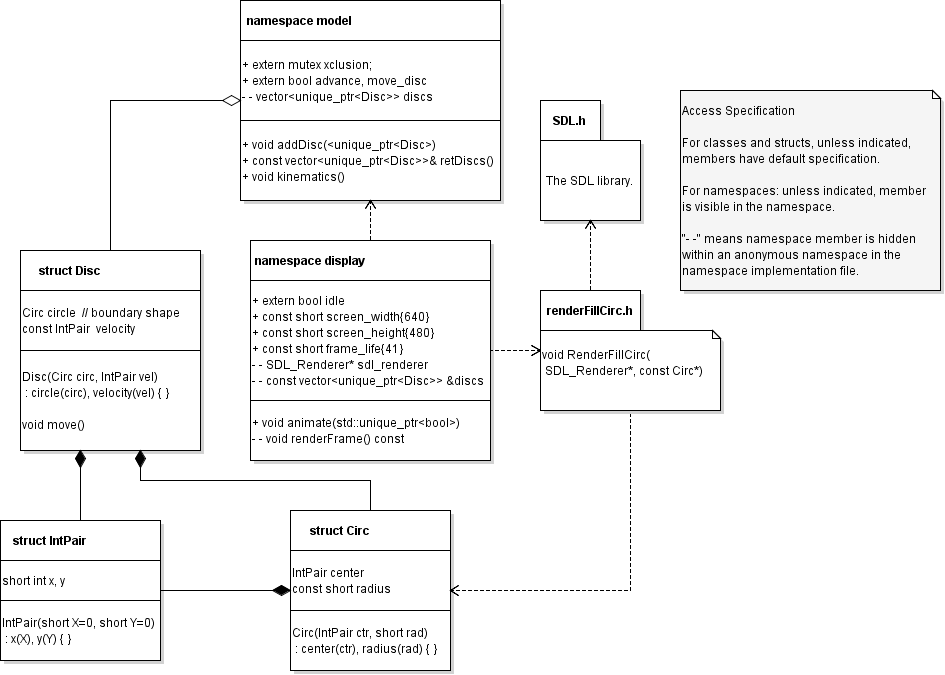
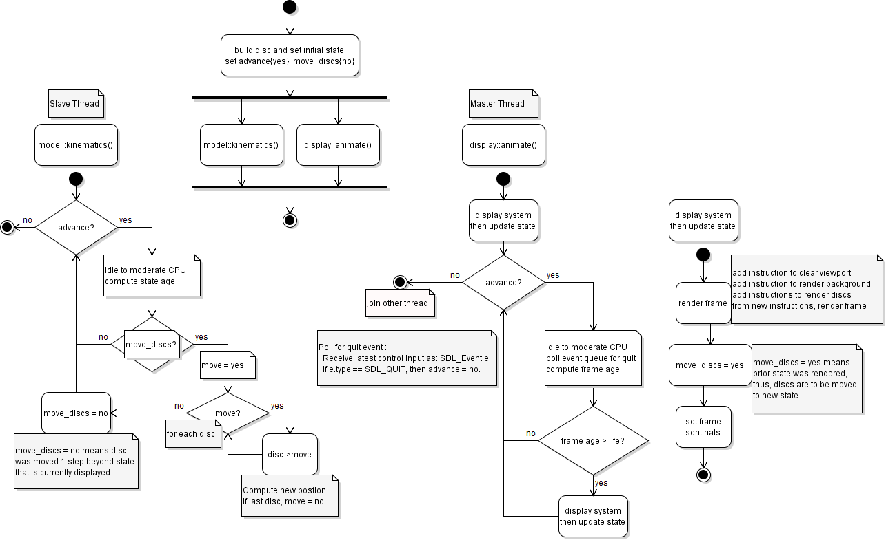

# Disk Simulation with Free Rectilinear Motion
Objective: This project is built from scratch and exhibits various aspects of C++.

## Description
This project is a two-dimensional simulation of disks, each moving along a rectilinear path with constant velocity. Each disk moves freely, oblivious to any other disk. There are no collisions or field force effects. The initial position and velocity of each disk are selected randomly from prescribed number ranges of uniform distribution. A Mersenne Twister pseudo-random number generator is employed along with a non-deterministic seed generator. The motion is confined to a rectangular domain with periodic boundary conditions. Computation and animation of the simulation are performed on separate processor threads. The simulation ends upon user input for termination through the application window. A sample screenshot of the project execution is shown in Figure 1.

<br>
*Fig. 1. Sample Execution Screenshot*

## Design
Below are images of UML-like class and activity diagrams, Figures 2 and 3, respectively. C++ like pseudocode is employed within those diagrams.

<br>
*Fig. 2. Class Diagram*

Note that an algorithm for rending a disk was manually implemented. It is executed by function `RenderFillCirc`, declared in header file `renderFillCirc.h`.

<br>
*Fig. 3. Activity Diagram*

The activity diagram shows how the computation and animation of the simulation are performed on separate processor threads. User input is managed by the master thread. The Boolean variable `model::advance` is initialized as true and becomes false when a program quit event is registered.

## Environment
This project was developed on Bento/Ubuntu 19.04 with the following packages installed via package manager:
```
  build-essential
  libsdl2-dev
```
`libsdl2-dev` contains the the Simple DirectMedia Layer library ([SDL](https://www.libsdl.org/)). Animation rendering is performed with this library. In the project, this library is referenced by the header file inclusion `#include "SDL.h"`. The build-essential package included the GCC 8.3.0 (Ubuntu 8.3.0-6ubuntu1) compiler employed to compile C++ code according to the 2017 standard. It also includes the make utility. Make was employed to build this project. A make file was manually developed for this project. Successful compilation was achieved without warnings according to the "-Wall" flag and with optimization according to the "-O3" flag.

## Execution
Open a shell in an environment as described above. Enter the project root directory. Build the project by entering `make`:
```bash
  $ make
```
The executable will be placed in the project root directory. Execute the project by:
```bash
  $ ./discs_freeMotion
```
